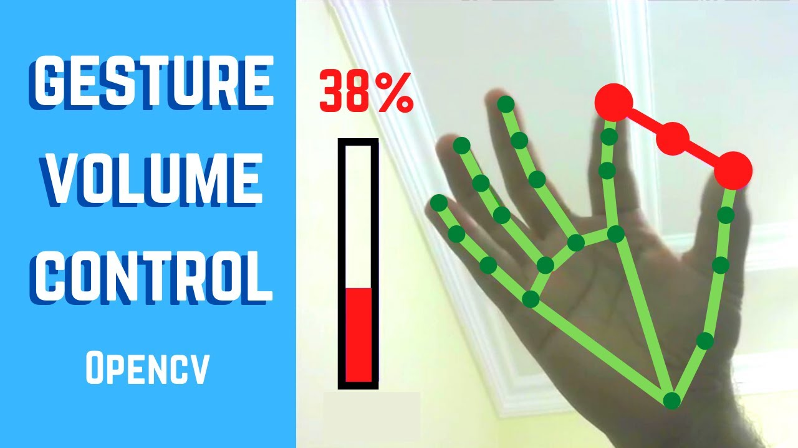

# Gesture Volume Control 🤚🔊

<div align="center">

A Python application that uses real-time hand tracking to control system volume through finger gestures, powered by MediaPipe and OpenCV.

<br>
<div align="center">
  <a href="https://codeload.github.com/TendoPain18/gesture-volume-control/legacy.zip/main">
    
  </a>
</div>
<br>
<br>



</div>

## 🖐️ About The Project

Gesture Volume Control lets you adjust your system's audio volume hands-free by measuring the distance between your thumb and index finger in front of your webcam. The closer your fingers are, the lower the volume; spread them apart to increase it. The project also includes screen brightness control as an extension.

It is built on top of a modular hand tracking module powered by MediaPipe, with an FPS counter for real-time performance monitoring.

## ✨ Features

- **Real-Time Hand Tracking**: Detects and tracks hand landmarks at high frame rates using MediaPipe
- **Gesture-Based Volume Control**: Maps the distance between thumb tip and index finger tip to system volume (0–100%)
- **Normalized Distance**: Hand size normalization ensures consistent control regardless of how close the hand is to the camera
- **Visual Feedback**: Draws connecting line and center circle between tracked fingers; circle turns green when volume is at minimum
- **FPS Display**: Live frames-per-second counter rendered on screen
- **Screen Brightness Control**: Additional module to control monitor brightness using the same gesture

## 🔬 How It Works

### Hand Landmark Detection

MediaPipe detects 21 hand landmarks. The application uses:
- **Landmark 0**: Wrist — used as reference for hand size normalization
- **Landmark 4**: Thumb tip
- **Landmark 5**: Index finger MCP — used as reference for normalization
- **Landmark 8**: Index finger tip

### Distance-to-Volume Mapping

```python
# Normalize distance relative to hand size
factor = 1800 / hand_size_length

# Map normalized finger distance to volume percentage
vol = map_range(length * factor, 450, 2550, 0, 100)

# Apply smoothing (rounded to nearest 5%)
smooth = 5
vol = round(vol / smooth) * smooth

# Set system volume
volume.SetMasterVolumeLevelScalar(vol / 100, None)
```

### Volume Control (Windows)

System audio is controlled via the Windows Core Audio API through the `pycaw` library:

```python
devices = AudioUtilities.GetSpeakers()
interface = devices.Activate(IAudioEndpointVolume._iid_, CLSCTX_ALL, None)
volume = cast(interface, POINTER(IAudioEndpointVolume))
```

## 🚀 Getting Started

### Prerequisites

- Python 3.7+
- Windows OS (for `pycaw` volume control)
- Webcam

### Installation

1. **Clone the repository**
```bash
git clone https://github.com/TendoPain18/gesture-volume-control.git
cd gesture-volume-control
```

2. **Install dependencies**
```bash
pip install opencv-python mediapipe pycaw comtypes screen-brightness-control
```

3. **Run the application**
```bash
cd code
python volume_control.py
```

## 📖 Usage

1. Run `volume_control.py`
2. Hold your hand in front of the webcam
3. Pinch your **thumb** and **index finger** together to lower the volume
4. Spread them apart to raise the volume
5. The line between fingers turns **green** when volume reaches minimum
6. Press `q` or close the window to exit

For screen brightness control, run `test2.py` instead — it uses the same gesture mapped to monitor brightness via `screen_brightness_control`.

## 🛠️ Built With

- **Language**: Python
- **Computer Vision**: OpenCV
- **Hand Tracking**: MediaPipe
- **Volume Control**: pycaw (Windows Core Audio API)
- **Brightness Control**: screen-brightness-control

## 🙏 Acknowledgments

- [Murtaza's Workshop - Robotics and AI](https://www.youtube.com/@murtazasworkshop) for the gesture control tutorial

<br>
<div align="center">
  <a href="https://codeload.github.com/TendoPain18/gesture-volume-control/legacy.zip/main">
    
  </a>
</div>
<br>

## <!-- CONTACT -->
<div id="toc" align="center">
  <ul style="list-style: none">
    <summary>
      <h2 align="center">
        🚀
        CONTACT ME
        🚀
      </h2>
    </summary>
  </ul>
</div>
<table align="center" style="width: 100%; max-width: 600px;">
<tr>
  <td style="width: 20%; text-align: center;">
    <a href="https://www.linkedin.com/in/amr-ashraf-86457134a/" target="_blank">
      
    </a>
  </td>
  <td style="width: 20%; text-align: center;">
    <a href="https://github.com/TendoPain18" target="_blank">
      
    </a>
  </td>
  <td style="width: 20%; text-align: center;">
    <a href="mailto:amrgadalla01@gmail.com">
      
    </a>
  </td>
  <td style="width: 20%; text-align: center;">
    <a href="https://www.facebook.com/amr.ashraf.7311/" target="_blank">
      
    </a>
  </td>
  <td style="width: 20%; text-align: center;">
    <a href="https://wa.me/201019702121" target="_blank">
      
    </a>
  </td>
</tr>
</table>
<!-- END CONTACT -->

**Control your volume without touching a thing! 🤚✨**
